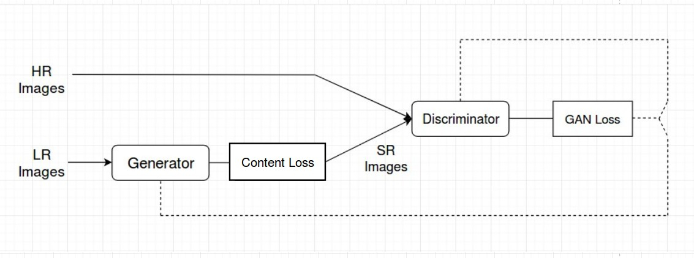
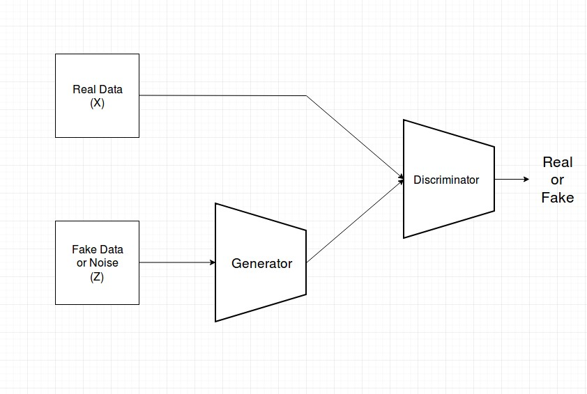
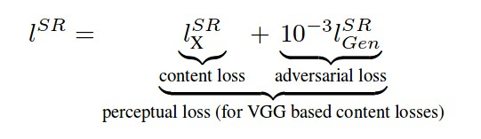
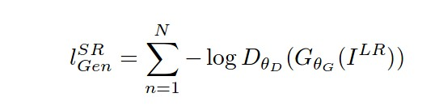
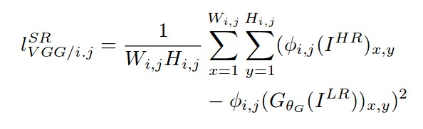

## Photo-Realistic Single Image Super-Resolution Using a Generative Adversarial Network implemented in Keras

## Architecture:
    

    
## Generator and Discriminator Network:

## Perceptual Loss
 
## Adversarial  Loss
 
## Content Loss
 
    
## Network Details:
    * 16 Residual blocks used.
    * PixelShuffler x2: This is feature map upscaling. 2 sub-pixel CNN are used in Generator.
    * PRelu(Parameterized Relu): We are using PRelu in place of Relu or LeakyRelu. It introduces learn-able parameter 
      that makes it possible to adaptively learn the negative part coefficient.
    * k3n64s1 this means kernel 3, channels 64 and strides 1.
    * Loss Function: We are using Perceptual loss. It comprises of Content(Reconstruction) loss and Adversarial loss.
    

## How to use
`
python3 test.py
`

Reference:
[/Keras-SRGAN)](https://github.com/deepak112/Keras-SRGAN)